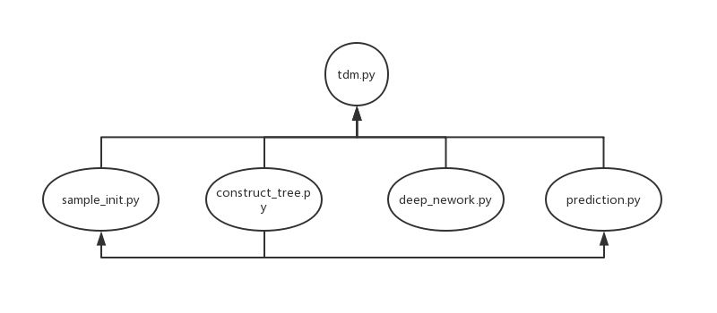
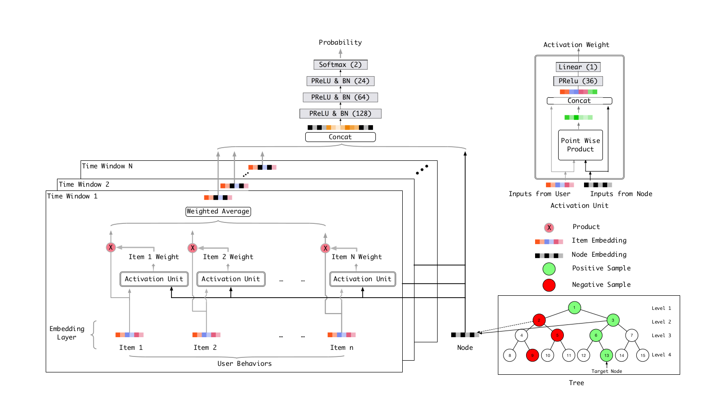

# 深度树模型实验
---

## 目录
- 实验环境
- 代码结构
- 算法模型
- 进度
- 参考文献

### 实验环境
    系统环境: ubuntu 18.04LTS
    IDE：PyCharm 2018.3
    实验数据集：[User Behavior Data](https://tianchi.aliyun.com/dataset/dataDetail?dataId=649&userId=1)

### 代码结构

    文件说明
    tdm.py: 代码入口，负责完整深度树模型的训练和测试
    sample_init.py: 数据处理及生成程序，负责数据预处理及树样本的生成
    construct_tree.py: 样本二叉树生成程序，负责树模型的生成
    deep_network.py: DNN的实现程序，负责网络的搭建
    prediction.py: 树节点预测及模型评测程序，负责模型预测及性能验证

### 算法模型

    深度树算法流程(文献[1)]:
    1. 构造随机二叉树并生成样本
    2. 训练DNN模型直到收敛
    3. 基于DNN模型得到样本的Embedding，重新构造聚类二叉树
    4. 循环上述过程

### 进度
    完成功能测试，跑通模型
    TODO: 改进性能，验证模型

### 参考文献
    [1] Learning Tree-based Deep Model for Recommender Systems, Han Zhu, Xiang Li, Pengye Zhang, etc.
    [2] Deep Interest Network for Click-Through Rate Prediction, Guorui Zhou, Chengru Song, Xiaoqiang Zhu, etc.
    [3] Empirical Evaluation of Rectified Activations in Convolution Network, Bing Xu, Naiyan Wang, Tianqi Chen, etc.
    [4] Delving Deep into Rectifiers: Surpassing Human-Level Performance on ImageNet Classification, Kaiming He, Xiangyu Zhang, Shaoqing Ren, etc.
    [5] Distributed Representations of Words and Phrases and their Compositionality, Tomas Mikolov, Ilya Sutskever, Kai Chen, etc.
